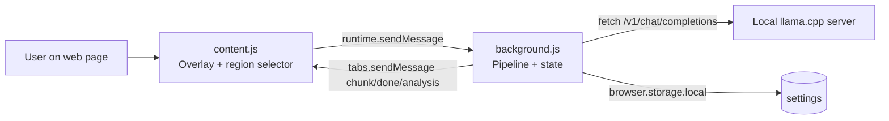
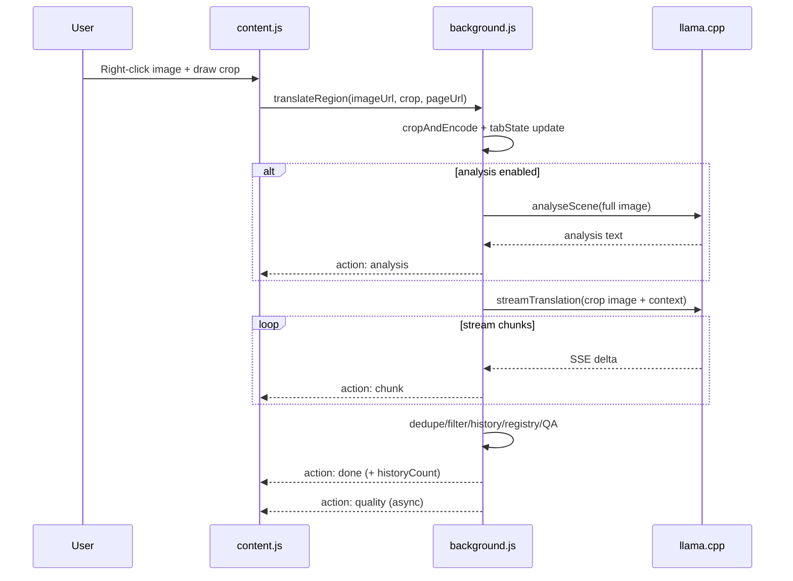

# Architecture

## Component map
- **Manifest wiring**: MV2 background script + content script on all URLs. Source: `manifest.json` (top-level `background`, `content_scripts`, `permissions`).
- **Background (`background.js`)**: orchestration, llama.cpp requests, history/registry/QA, settings persistence, message contract hub. Source: `background.js` (`browser.runtime.onMessage`, `streamTranslation`, `updateStoryRegistry`, `qualityCheck`).
- **Content (`content.js`)**: DOM UI/overlay, region selection, user interactions, rendering streamed output. Source: `content.js` (`showOverlay`, `startSel`, `render`, `browser.runtime.onMessage`).

## Translation request lifecycle

## Concurrency + state boundaries
- Per-tab isolation comes from `tabState[tabId]`, `pageHistory[tabId]`, and `storyRegistry[tabId]`. Source: `background.js` (`tabState`, `pageHistory`, `storyRegistry`, `browser.tabs.onRemoved`).
- Retroactive context updates are queued per tab (`Map` + in-flight `Set`) to prevent overlapping writes for that tab. Source: `background.js` (`retroactiveQueue`, `retroactiveInFlight`, `queueRetroactiveUpdate`).
- TODO: confirm whether translation runs themselves are intentionally non-serialized per tab (no explicit in-flight guard in `streamTranslation` call sites). Source: `background.js` (`translateRegion`/`retry` branches call `streamTranslation` directly).
